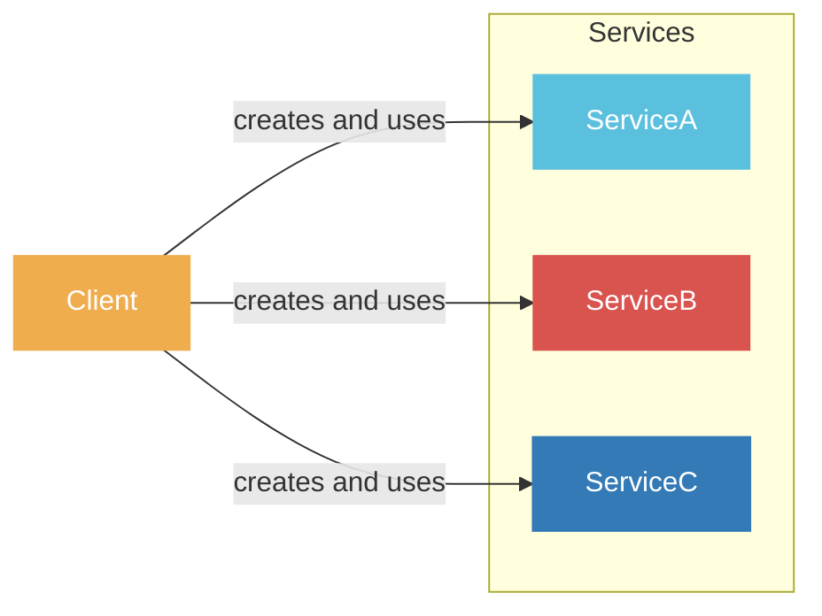
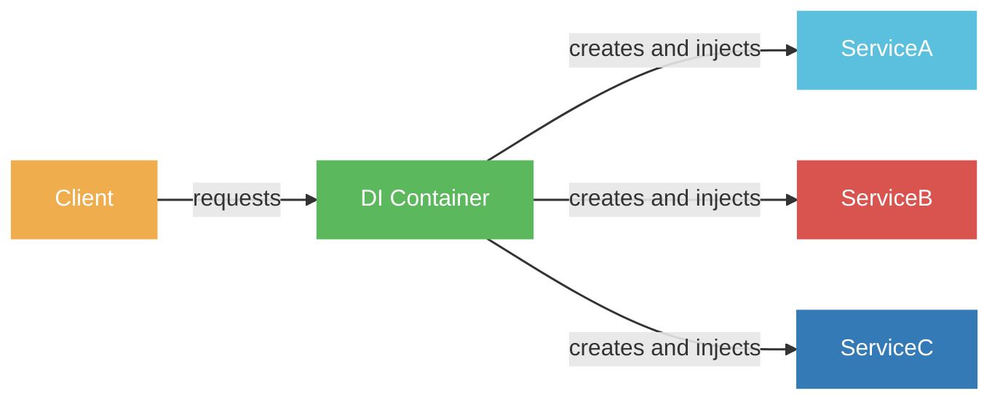
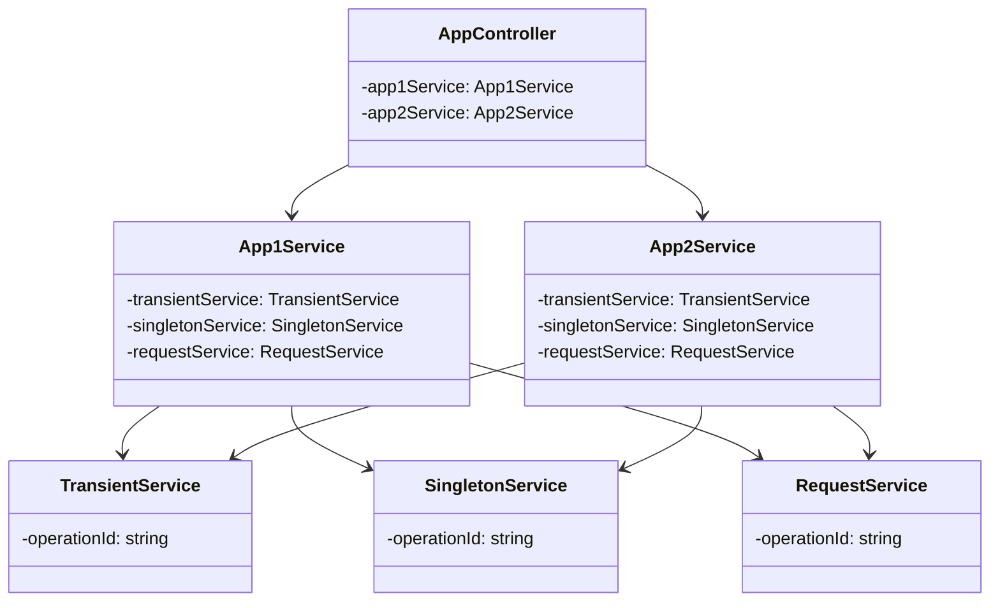
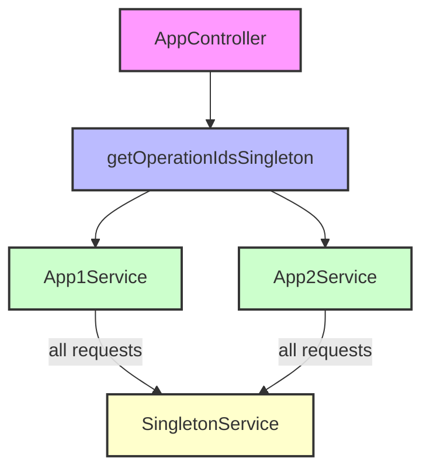
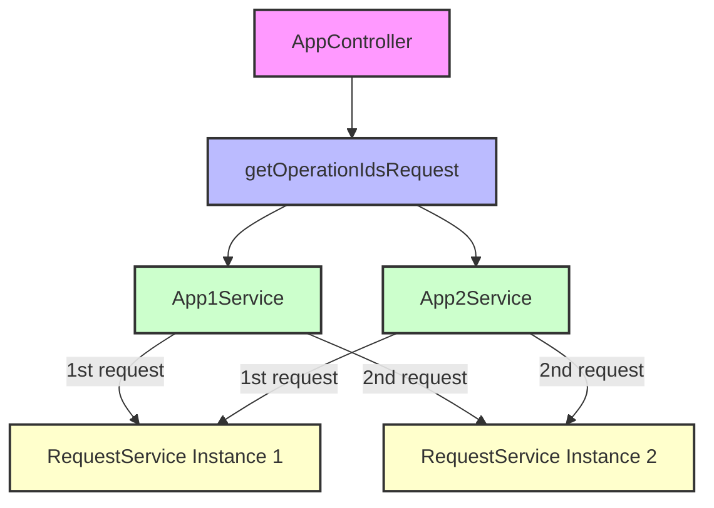
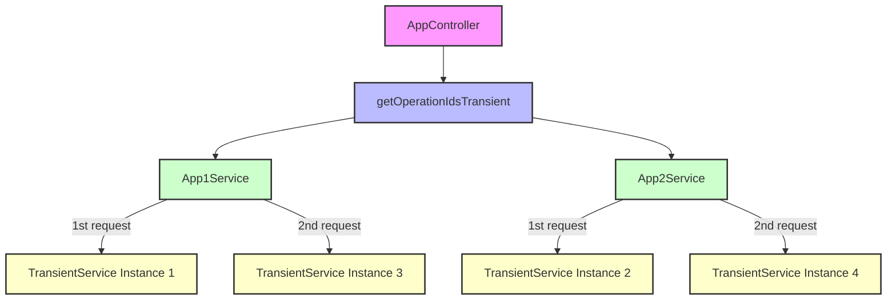

# INJECTION SCOPE

In NestJS, components like database connections and services are often shared across all incoming requests. This design choice stems from the underlying architecture of NestJS, which doesn't create separate threads for each request. Sharing these resources is a safe and efficient approach in this context
However, there are scenarios where you might intentionally want a new instance of a component for each request. This could be necessary for:
Per-Request Caching: In applications like GraphQL, caching data specific to each request can enhance performance.
Request Tracking: If you need to log or analyze details of individual requests, having instances tied to each request makes sense.
Multi-Tenancy: For applications serving multiple clients or organizations, isolated instances for each tenant are often crucial for data security and privacy.

NestJS provides a powerful feature called "injection scopes" to handle these requirements. You can specify the lifetime of a component as:
Singleton: A single instance shared across the entire application (the default).
Request: A new instance created and used for each incoming request, ensuring isolation.
Transient: A new instance created every time the component is requested, providing maximum flexibility.

## Introduction to Dependency Injection in NestJS
**Dependency Injection (DI)** is a design pattern used to implement **IoC** (Inversion of Control), allowing for the decoupling of dependencies between components in an application. In NestJS, DI is a core concept that enables the efficient management and instantiation of classes and their dependencies, enhancing modularity, testability, and maintainability.

**Without DI**



**With DI**



NestJS uses decorators to define the injectability of classes. Services, controllers, and repositories are registered in the NestJS IoC container, which handles their lifecycle and injection. The main types of injection scopes in NestJS are:

**Singleton Scope** ( default ): A single instance of the provider is shared across the entire application. The instance lifetime is tied directly to the application lifecycle. Once the application has bootstrapped, all singleton providers have been instantiated. Singleton scope is used by default.

**Request Scope**: A new instance of the provider is created exclusively for each incoming request. The instance is garbage-collected after the request has completed processing.

**Transient Scope**: Transient providers are not shared across consumers. Each consumer that injects a transient provider will receive a new, dedicated instance.

## App Overview





### Controller

The AppController has three endpoints:

- `/singleton`: Demonstrates Singleton scope.
- `/request`: Demonstrates Request scope.
- `/transient`: Demonstrates Transient scope.
Each endpoint calls corresponding methods in App1Service and App2Service to fetch operation IDs from services with different scopes.


``` typescript
//...

@Controller()
export class AppController {
  constructor(
    private readonly app1Service: App1Service,
    private readonly app2Service: App2Service,
  ) {}

  @Get('/singleton')
  getOperationIdsSingleton(): string[] {
    const id1 = this.app1Service.getOperationIdBySingletonScopeService();
    const id2 = this.app2Service.getOperationIdBySingletonService();
    // id1 and id2 should be the same for each request
    // id1 of 1st request should be same from id1 of 2nd request
    return [id1, id2];
  }

  @Get('/request')
  getOperationIdsRequest(): string[] {
    const id1 = this.app1Service.getOperationIdByRequestScopeService();
    const id2 = this.app2Service.getOperationIdByRequestService();
    // id1 and id2 should be same
    // id1 of 1st request should be different for each request
    return [id1, id2];
  }
  @Get('/transient')
  getOperationIdsTransient(): string[] {
    const id1 = this.app1Service.getOperationIdByTransientScopeService();
    const id2 = this.app2Service.getOperationIdByTransientService();
    // id1 and id2 should be different
    // id1 of 1st request should be different from id1 of 2nd request
    return [id1, id2];
  }
}
```

### Services

`AppService1` and `AppService2` are injected with `TransientService`, `SingletonService`, and `RequestService`.

`AppService1` and `AppService2` are singletons by default.

Using `@Injectable` to Set Scope for Services in NestJS

```typescript
//...
@Injectable()

export class App1Service {
  constructor(
    private readonly transientService: TransientService,
    private readonly singletonService: SingletonService,
    private readonly requestService: RequestService,
  ) {} //

 //...
}

//...
@Injectable()
export class App2Service {
  constructor(
    private readonly transientService: TransientService,
    private readonly singletonService: SingletonService,
    private readonly requestService: RequestService,
  ) {} //

//...
}

//...
@Injectable({ scope: Scope.REQUEST })
export class RequestService {
  private readonly operationId: string;

  constructor() {
    this.operationId = Math.random().toString(); // Generate a new random ID on each instantiation
  }

  getOperationId(): string {
    return this.operationId;
  }
}

//...

@Injectable({ scope: Scope.DEFAULT })
export class SingletonService {
  private readonly operationId: string;

    //...
  }
}

import { Injectable, Scope } from '@nestjs/common';

@Injectable({ scope: Scope.TRANSIENT })
export class TransientService {
  private readonly operationId: string;

 //...
}
```

## Singleton Scope

Make a request to the `/singleton` endpoint multiple times.

```bash
GET http://localhost:3000/singleton
```

Response:

```json
1st request: ["0.123456789","0.123456789"]
2nd request: ["0.123456789","0.123456789"]
```

The service is instantiated once and shared across the entire application.
The operationId should remain the same for every request.



## Request Scope

Make a request to the `/request` endpoint multiple times.

```bash
GET http://localhost:3000/request
```

Response:

```json
1st request: [
  "0.03174589572087694","0.03174589572087694"
]
2nd request: [
  "0.766775188681746","0.766775188681746"
]
```

A new instance of the service is created for each incoming request.
The operationId should be the same within a single request but different across different requests.



## Transient Scope

Make a request to the `/transient` endpoint multiple times.

```bash
GET http://localhost:3000/transient
```

Response:

```json
1st request: [
  "0.39868651493769636","0.10509906173309358"
]
2nd request: [
  "0.0018363851423925937","0.17012399404242795"
]
```

A new instance of the service is created every time it is injected.
The operationId should be different each time it is accessed, even within the same request.




## TEST RESULTS


```bash
### Singleton
GET http://localhost:3000/singleton

### Transient
GET http://localhost:3000/transient

### Request
GET http://localhost:3000/request

```

## Conclusion

In this example, we have demonstrated how to use the `@Injectable()` decorator to define the scope of a service in NestJS. By specifying the scope of a service, you can control how instances of that service are created and managed within your application. This can be useful for managing state, controlling resource usage, and ensuring that services behave as expected in different contexts. By understanding the different scopes available in NestJS, you can design your application to be more efficient, maintainable, and scalable.
